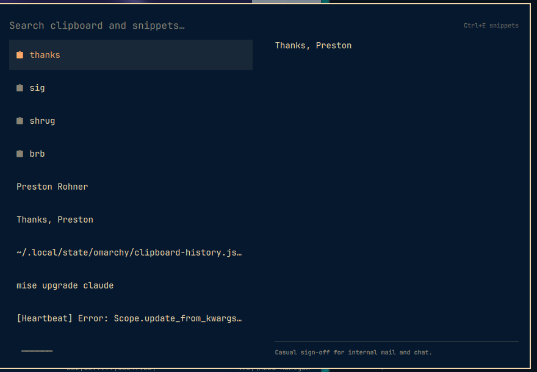

# Omarchy Snippets

Alfred-style text snippets inside the Omarchy clipboard picker.

Press `SUPER + CTRL + V`, type `thanks`, press Enter — `Thanks, Preston` is
pasted. Your snippets sit pinned above the clipboard history, are searched
alongside it, and never age out of it.



## Why this exists

Omarchy's clipboard history is capped at the 300 most recent entries, so
seeding it with canned text does not hold — a busy afternoon of copying pushes
your snippets off the end. This plugin keeps snippets in their own file and
merges them into the picker at display time, so they are always one search
away.

## Install

```bash
omarchy plugin add https://github.com/prohner/omarchy-snippets.git --enable --yes
```

Plugins run as unsandboxed code inside `omarchy-shell`. Drop `--yes` to review
the source before enabling it — that is the recommended path.

That is the entire install. **No keybinding to add, no config to edit.** The
plugin declares `"omarchy": { "clonedFrom": "omarchy.clipboard" }` in its
manifest, and Omarchy's plugin registry routes calls addressed to the built-in
clipboard to whichever enabled plugin declares that. Your stock
`SUPER + CTRL + V` binding already runs
`omarchy-shell shell toggle omarchy.clipboard`, so it lands here instead. The
built-in clipboard plugin is disabled automatically while this one is enabled.

Uninstalling restores it just as automatically:

```bash
omarchy plugin remove io.github.prohner.snippets
```

Your `snippets.json` is left alone — it lives in `~/.config/omarchy/`, not in
the plugin directory, so both removing and updating the plugin leave it
untouched.

## Keys

In the picker (`SUPER + CTRL + V`):

| Key | Action |
|-----|--------|
| *type anything* | search snippets and clipboard history together |
| `Enter` | paste the highlighted entry |
| `Shift+Enter` | copy it without pasting |
| `Alt+Enter` | on a snippet, edit it; on history, open it externally |
| `Ctrl+E` | open the snippet editor |
| `Delete` | delete a clipboard entry (snippets are not deleted from here) |
| `Esc` | clear the search, then close |

In the editor (`Ctrl+E`):

| Key | Action |
|-----|--------|
| `Ctrl+N` | new snippet |
| `Ctrl+S` | save |
| `Tab` / `Shift+Tab` | move between Trigger, Body, and Notes |
| `Esc` | save and go back to the picker |

## Editing snippets

`Ctrl+E` opens a master-detail editor in the same window: the snippet list on
the left, the selected snippet's trigger and body on the right, and a notes
field below it for recording what a snippet is for. Notes are searchable and
show under the body in the picker preview.


Everything is stored as plain JSON at `~/.config/omarchy/snippets.json`:

```json
{
  "snippets": [
    {
      "trigger": "thanks",
      "body": "Thanks, Preston",
      "notes": "Casual sign-off for internal mail and chat."
    }
  ]
}
```

- **trigger** — what you type to find it. Optional; a snippet without one is
  labeled by the first line of its body.
- **body** — what gets pasted, newlines and all.
- **notes** — free text for yourself. Searchable, never pasted.

If you would rather use your own editor, the **Open snippets.json in $EDITOR**
button hands the file to `omarchy-launch-editor` (your Omarchy editor default,
Neovim unless you changed it). The plugin watches the file, so saving there
shows up in the picker immediately — no restart. A bare top-level array works
too, if you are writing the file by hand.

If the file has a syntax error, the picker says so in the header rather than
silently showing an empty library. Your file is never rewritten until you make
an edit in the GUI editor.

### How search ranks results

Typing matches triggers, bodies, and notes, but an exact trigger match always
wins. Without that, searching `sig` would surface a snippet whose notes read
"casual sign-**off**" ahead of the snippet actually named `sig`. Order is:
exact trigger, trigger prefix, trigger substring, body, notes — ties keep the
order you wrote them in.

Snippets always sort above clipboard history.

## Development

```bash
git clone https://github.com/prohner/omarchy-snippets.git
ln -s "$PWD/omarchy-snippets" ~/.config/omarchy/plugins/io.github.prohner.snippets
omarchy-shell shell rescanPlugins
omarchy plugin enable io.github.prohner.snippets
```

Saving a `.qml` file under `~/.config/omarchy/plugins/` hot-reloads it. **A
change to `Snippets.js` does not** — the QML engine caches JavaScript imports,
so run `omarchy restart shell` after editing it. This is easy to lose an hour
to.

Run the tests with no dependencies:

```bash
node test/snippets.test.js
```

`Snippets.js` deliberately imports nothing from QML so the search ranking and
file parsing can be tested in plain node.

### Staying current with upstream

`Clipboard.qml` is a fork of Omarchy's built-in clipboard overlay, currently
tracking **Omarchy 4.0.2-1**. Every deviation from the original is marked with
a `+snippets` comment, and everything else lives in files upstream does not
have (`Snippets.js`, `SnippetsEditor.qml`, `SnippetTextArea.qml`). To pick up
upstream changes:

```bash
diff -u /usr/share/omarchy/shell/plugins/clipboard/Clipboard.qml Clipboard.qml
```

Every hunk should be `+snippets`-marked. Re-copy the upstream file, re-apply
those hunks, and bump the version noted above. `ClipboardHistory.js` is a
verbatim copy — replace it wholesale. `capture.sh` is deliberately *not*
vendored; the plugin points at the copy in `/usr/share/omarchy/`, which also
keeps its watcher matching the pkill pattern that reaps stale watchers.

## License

MIT
