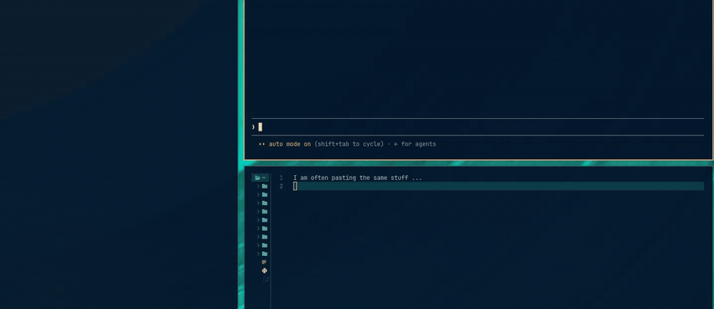
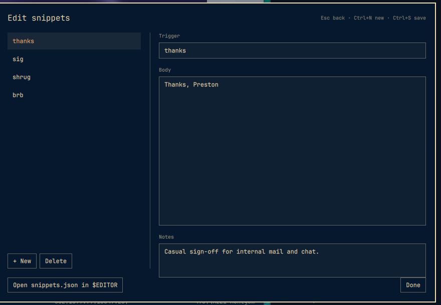

# Snippets for Omarchy

Alfred-style text snippets inside the Omarchy clipboard picker. Press
`SUPER + CTRL + V`, type `thanks`, press Enter — `Thanks, Preston` is pasted.

No accounts. No cloud. Just a JSON file on disk.



The picker opens on your clipboard history as always. Type, and matching
snippets jump to the top — Enter pastes.

Omarchy's clipboard history is capped at 300 entries, so canned text seeded
into it gets pushed off the end by an afternoon of copying. Snippets live in
their own file and are merged into the picker at display time, so they are
always one search away.

## Install

```bash
omarchy plugin add https://github.com/prohner/omarchy-snippets.git --enable
omarchy restart shell
```

No keybinding to add and no config to edit. The manifest declares
`clonedFrom: omarchy.clipboard`, so your existing `SUPER + CTRL + V` opens this
instead of the built-in picker. The built-in is disabled while this is enabled,
and comes back when you remove it.

Plugins run unsandboxed inside `omarchy-shell`. Drop `--enable` to read the
code before turning it on.

## Usage

- **Open** — `SUPER + CTRL + V`, the same key as always
- **Search** — start typing; snippets and clipboard history are searched together
- **Paste** — Enter on the highlighted row
- **Out of the way until you search** — with an empty box this is the ordinary
  clipboard picker, snippets sitting below the history. Type anything and the
  best-matching snippet jumps to the top
- **Never evicted** — clipboard history rolls over at 300 entries; snippets do not
- **Edit** — `Ctrl+E` opens the editor: list on the left, trigger and body on
  the right, notes underneath
- **Notes** are searchable, shown under the body in the preview, and never pasted

An exact trigger match always wins. Ranking is: exact trigger, trigger prefix,
trigger substring, body, notes — ties keep the order you wrote them in.



## Keyboard

In the picker:

- Type anything to search
- **Enter** pastes the highlighted entry
- **Shift+Enter** copies it without pasting
- **Alt+Enter** edits a snippet, or opens a history entry externally
- **Ctrl+E** opens the snippet editor
- **Delete** removes a clipboard entry (snippets are deleted from the editor)
- **Escape** clears the search, then closes

In the editor:

- **Ctrl+N** new snippet
- **Ctrl+S** save
- **Tab / Shift+Tab** move between Trigger, Body, and Notes
- **Escape** saves and goes back to the picker

## Data

Snippets are stored at:

```
~/.config/omarchy/snippets.json
```

The picker watches that file, so another tool or agent can read and write it.
Saving from an editor shows up immediately, with no restart.

```json
{
  "snippets": [
    {
      "trigger": "thanks",
      "body": "Thanks, Preston",
      "notes": "Casual sign-off for internal mail and chat."
    }
  ]
}
```

- **trigger** — what you type to find it. Optional; a snippet without one is
  labeled by the first line of its body
- **body** — what gets pasted, newlines and all
- **notes** — free text for yourself. Searchable, never pasted

A bare top-level array works too, if you are writing the file by hand. If the
file has a syntax error the picker says so in its header rather than silently
showing an empty library, and your file is not rewritten until you make an edit
in the editor.

The **Open snippets.json in $EDITOR** button hands the file to
`omarchy-launch-editor`, which respects your Omarchy editor default.

Clipboard history is Omarchy's own file and is not touched by this plugin:

```
~/.local/state/omarchy/clipboard-history.json
```

## Remove

```bash
omarchy plugin remove io.github.prohner.snippets --yes
omarchy restart shell
```

That restores the built-in clipboard picker. It does **not** delete
`~/.config/omarchy/snippets.json`. Remove that file yourself if you want the
snippets gone too. Updating the plugin never touches it either.

## Requirements

Omarchy 4 with Quickshell. No extra packages — pasting uses the same
`omarchy-clipboard-paste-text` helper the built-in picker uses.

## Development

```bash
git clone https://github.com/prohner/omarchy-snippets.git
ln -s "$PWD/omarchy-snippets" ~/.config/omarchy/plugins/io.github.prohner.snippets
omarchy-shell shell rescanPlugins
omarchy plugin enable io.github.prohner.snippets
```

Saving a `.qml` file hot-reloads it. **A change to `Snippets.js` does not** —
the QML engine caches JavaScript imports, so run `omarchy restart shell` after
editing it.

```bash
node test/snippets.test.js
```

`Snippets.js` imports nothing from QML, so the search ranking and file parsing
are tested in plain node with no dependencies.

### Staying current with upstream

`Clipboard.qml` is a fork of Omarchy's built-in clipboard overlay, tracking
**Omarchy 4.0.2-1**. Every deviation is marked `+snippets`, and all new
behavior lives in files upstream does not have (`Snippets.js`,
`SnippetsEditor.qml`, `SnippetTextArea.qml`).

```bash
diff -u /usr/share/omarchy/shell/plugins/clipboard/Clipboard.qml Clipboard.qml
```

Every hunk should be `+snippets`-marked. To pick up a new release, re-copy the
upstream file, re-apply those hunks, and bump the version above.
`ClipboardHistory.js` is a verbatim copy — replace it wholesale. `capture.sh`
is deliberately not vendored; pointing at the packaged copy keeps the watcher
matching the pkill pattern that reaps stale watchers.

## License

MIT
