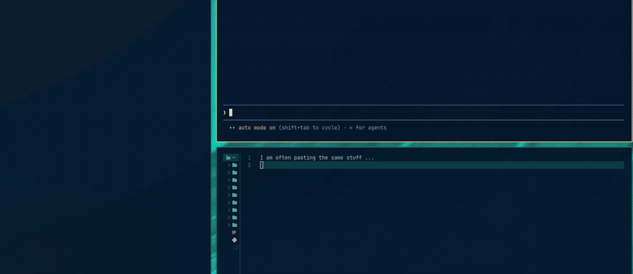
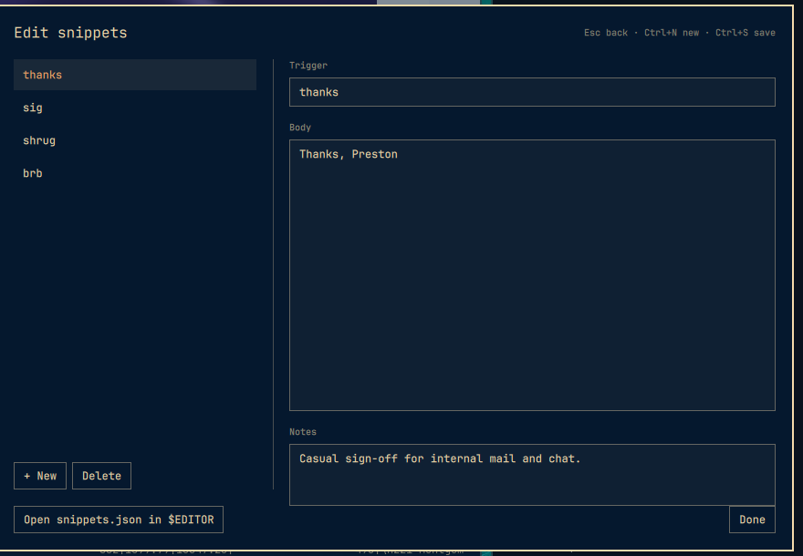
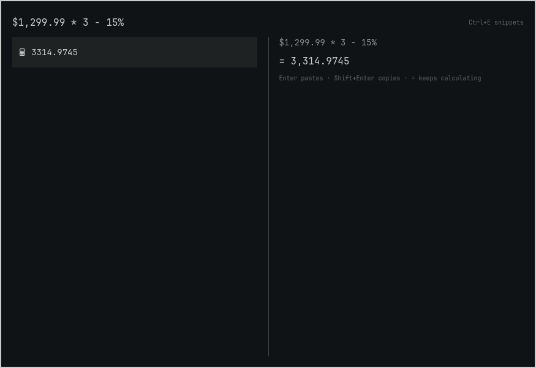

# Snippets for Omarchy

Fast text snippets inside the Omarchy clipboard picker. Press
`SUPER + CTRL + V`, type `new_feature` (your trigger words), press Enter —
your custom text is pasted.

No accounts. No cloud. Just a JSON file on disk.



The picker opens on your clipboard history as always. Type, and matching
snippets jump to the top — Enter pastes.

Type a sum instead — `1,299.99 * 3 - 15%` — and the answer is the top row,
Alfred-style. Enter pastes it.

Omarchy's clipboard history is capped at 300 entries, so canned text seeded
into it gets pushed off the end by an afternoon of copying. Snippets live in
their own file and are merged into the picker at display time, so they are
always one search away.

## Install

```bash
omarchy plugin add https://github.com/prohner/omarchy-snippets.git --enable
omarchy restart shell
```

No keybinding to add and no config to edit. The manifest declares
`clonedFrom: omarchy.clipboard`, so your existing `SUPER + CTRL + V` opens this
instead of the built-in picker. The built-in is disabled while this is enabled,
and comes back when you remove it.

Plugins run unsandboxed inside `omarchy-shell`. Drop `--enable` to read the
code before turning it on.

## Usage

- **Open** — `SUPER + CTRL + V`, the same key as always
- **Search** — start typing; snippets and clipboard history are searched together
- **Paste** — Enter on the highlighted row
- **Out of the way until you search** — with an empty box this is the ordinary
  clipboard picker, snippets sitting below the history. Type anything and the
  best-matching snippet jumps to the top
- **Never evicted** — clipboard history rolls over at 300 entries; snippets do not
- **Edit** — `Ctrl+E` opens the editor: list on the left, trigger and body on
  the right, notes underneath
- **Notes** are searchable, shown under the body in the preview, and never pasted

An exact trigger match always wins. Ranking is: exact trigger, trigger prefix,
trigger substring, body, notes — ties keep the order you wrote them in.



## Calculator

Type arithmetic into the search box and the answer appears as the top row, the
way it does in [Alfred](https://www.alfredapp.com/help/features/calculator/).



- **Enter** pastes the answer, **Shift+Enter** copies it
- **Ctrl+C** copies the formula itself, exactly as typed, `=` prefix and all
- **`=`** at the end swaps the expression for its answer, so you can keep going:
  `2+2` `=` gives `4`, then type `*3`
- **`+ - * / ^`** and parentheses, with the usual precedence. `**`, `×`, `÷` work
  too
- **Percentages** — `100 + 10%` is 110, `100 - 15%` is 85, `200 * 15%` is 30.
  (Alfred's own calculator does not do this. Its users keep asking for it.)
- **Currency symbols are skipped**, and thousands separators are understood, so
  `$1,299.99` pasted from a web page works as it is
- **Your locale** decides the decimal mark. With a decimal comma, `1.234,5` is a
  number, and answers are written with a comma too

It stays out of the way of search. A bare number such as `42` or `2026` is still
a search, since a calculation needs an operator between two numbers. Anything
that is not complete arithmetic, like `git push` or `2 +`, gets no answer. A
snippet whose trigger is exactly what you typed still comes first.

### Advanced: start with `=`

As in Alfred, a leading `=` turns on functions and constants, and makes `%`
mean modulo:

```
=sqrt(2)        =sin(dtor(30))      =17 % 5        =pi * 2
```

`sin cos tan asin acos atan sinh cosh tanh asinh acosh atanh` (radians — `dtor`
and `rtod` convert), `log` (base 10) `log2 ln exp`, `abs sqrt cbrt`,
`ceil floor round trunc rint`, and the constants `pi` (or `π`) and `e`.

The preview pane lists all of this under an answer: a pointer to the `=`
functions beneath a plain sum, and the full list beneath an advanced one.

Answers carry 15 significant digits, so `0.1 + 0.2` is `0.3`. Division by zero
and the like produce no answer rather than `Infinity`.

## Keyboard

In the picker:

- Type anything to search
- **Enter** pastes the highlighted entry
- **Shift+Enter** copies it without pasting
- **Alt+Enter** edits a snippet, or opens a history entry externally
- **=** after a calculation replaces it with its answer
- **Ctrl+C** copies the calculation you typed, rather than its answer
- **Ctrl+E** opens the snippet editor
- **Delete** removes a clipboard entry (snippets are deleted from the editor)
- **Escape** clears the search, then closes

In the editor:

- **Ctrl+N** new snippet
- **Ctrl+S** save
- **Tab / Shift+Tab** move between Trigger, Body, and Notes
- **Escape** saves and goes back to the picker

## Data

Snippets are stored at:

```
~/.config/omarchy/snippets.json
```

The picker watches that file, so another tool or agent can read and write it.
Saving from an editor shows up immediately, with no restart.

```json
{
  "snippets": [
    {
      "trigger": "thanks",
      "body": "Thanks, Preston",
      "notes": "Casual sign-off for internal mail and chat."
    }
  ]
}
```

- **trigger** — what you type to find it. Optional; a snippet without one is
  labeled by the first line of its body
- **body** — what gets pasted, newlines and all
- **notes** — free text for yourself. Searchable, never pasted

A bare top-level array works too, if you are writing the file by hand. If the
file has a syntax error the picker says so in its header rather than silently
showing an empty library, and your file is not rewritten until you make an edit
in the editor. It says so too if the file turns out not to be a plain file it
can read, or if its own helper is not running.

Sizes are bounded, because this file is parsed inside the process that draws
your desktop: 512 snippets, a 256-character trigger, a 64 KiB body, and 4 KiB of
notes. A longer value is shortened rather than dropped. The body limit is not
arbitrary — the body is pasted by handing it to `omarchy-clipboard-paste-text`
as a single argument, and Linux refuses any argument longer than 128 KiB.

Clipboard entries are bounded the same way, as they are captured: 128 KiB of
text per copy, and images past 64 MiB are skipped rather than stored half
written. See [SECURITY.md](SECURITY.md) for why, and for everything else the
plugin does about running inside an unsandboxed shell.

The **Open snippets.json in $EDITOR** button hands the file to
`omarchy-launch-editor`, which respects your Omarchy editor default.

Clipboard history is Omarchy's own file and is not touched by this plugin:

```
~/.local/state/omarchy/clipboard-history.json
```

## Remove

```bash
omarchy plugin remove io.github.prohner.snippets --yes
omarchy restart shell
```

That restores the built-in clipboard picker. It does **not** delete
`~/.config/omarchy/snippets.json`. Remove that file yourself if you want the
snippets gone too. Updating the plugin never touches it either.

## Requirements

Omarchy 4 with Quickshell. No extra packages — pasting uses the same
`omarchy-clipboard-paste-text` helper the built-in picker uses.

`bin/omarchy-snippets-helper` needs to stay executable. It is the only program
the plugin runs, and everything that touches a process, the clipboard, or the
disk goes through it; if it cannot start, the picker says so in its header
instead of looking like an empty clipboard.

## Security

Plugins run unsandboxed inside `omarchy-shell`, so this one keeps the shell
process down to one job: drawing the picker. It runs exactly one executable and
opens no files of its own. Validated absolute executables, a built-not-inherited
environment, caps and deadlines applied where clipboard payloads are produced
rather than after they arrive, reads and writes performed through a directory
descriptor opened once and held, a bounded schema, and watchers killed by
recorded identity rather than by matching a command line.

[SECURITY.md](SECURITY.md) covers each of those, why it is done that way, and
what it costs you.

## Development

```bash
git clone https://github.com/prohner/omarchy-snippets.git
ln -s "$PWD/omarchy-snippets" ~/.config/omarchy/plugins/io.github.prohner.snippets
omarchy-shell shell rescanPlugins
omarchy plugin enable io.github.prohner.snippets
```

Saving a `.qml` file usually hot-reloads it. **A change to `Snippets.js` never
does** — the QML engine caches JavaScript imports. And when the plugin is
symlinked in from outside `~/.config/omarchy`, as above, the shell may not notice
a save at all and will happily keep running the code it loaded at startup. Check
what is actually running before concluding a change did nothing:

```bash
pgrep -a -f omarchy-snippets-helper
```

If in doubt, `omarchy restart shell`.

```bash
node test/snippets.test.js   # search ranking, parsing, and the schema bounds
node test/calculator.test.js # the calculator: answers, grammar, locale, bounds
test/helper.test.sh          # the helper, against a sandbox HOME
test/editor.test.sh          # the editor, in an offscreen quickshell
test/picker.test.sh          # the calculator inside the real picker
```

`Snippets.js` imports nothing from QML, so the search ranking, the file parsing,
and the size bounds are tested in plain node with no dependencies. The helper is
tested in bash, because what is worth testing about it — descriptor-safe reads,
atomic writes that a planted symlink cannot redirect, producer-side caps, and
killing a watcher by recorded identity rather than by resemblance — is exactly
the part that cannot be reached from QML.

The editor needs a QML engine, so it gets an offscreen `quickshell` with the
Omarchy shell's modules symlinked in beside the plugin and a stand-in for
`Clipboard.qml`. What that suite is really for is the round trip through the
file: the editor never owns its list, it is handed one and hands back a
replacement, and then the file watcher reports that write back about a second
later. Every editor bug worth having a test for has come from that echo landing
while the form was open — see the file's header. It skips itself where
quickshell is not installed.

The picker test loads the real `Clipboard.qml` in a second, isolated quickshell
instance. That needs a Wayland session, because the picker is a layer-shell
window, but nothing appears on screen: the overlay is never opened. It uses a
copy of the plugin whose helper is a stub, which serves a fixed snippet library
and logs each paste and copy it is asked for. Answers are checked there, in the
C locale and again in German, where the decimal mark is a comma.

None of the four touches your real snippet library, your real clipboard
history, or your clipboard.

### Trying a change without restarting your shell

`omarchy restart shell` takes your actual desktop down with it, and a plugin that
fails to load leaves you with no shell to fix it from. Load the plugin in a
second Quickshell instance instead. An overlay is only `visible` once it is
opened, so nothing appears on screen — but the helper, the watchers, the file
writes, and the parsing all run for real.

```bash
root=$(mktemp -d) && home=$(mktemp -d) && rt=$(mktemp -d)
for d in Commons Ui services; do ln -s "/usr/share/omarchy/shell/$d" "$root/$d"; done
ln -s "$PWD" "$root/plugin"
ln -s "$XDG_RUNTIME_DIR/$WAYLAND_DISPLAY" "$rt/$WAYLAND_DISPLAY"

cat > "$root/shell.qml" <<'QML'
import Quickshell
import QtQuick
import "plugin" as Snippets

ShellRoot {
  Snippets.Clipboard { id: plugin }
  Timer {
    interval: 5000; running: true; repeat: false
    onTriggered: {
      console.log("snippets=" + plugin.snippets.length
        + " history=" + plugin.history.length
        + " status=[" + plugin.statusHint + "]")
      Qt.quit()
    }
  }
}
QML

HOME=$home XDG_RUNTIME_DIR=$rt QT_QPA_PLATFORM=wayland quickshell -n -p "$root"
```

Both fake directories earn their place. The fake `HOME` keeps this off your real
snippet library and clipboard history, because the helper resolves both paths
from it. The fake `XDG_RUNTIME_DIR` keeps it off the watcher identity record,
which the helper also keeps there — your running shell has one, `reap` truncates
it at startup, and an instance sharing the directory would blank the record your
real shell depends on. Symlinking the compositor socket across is what lets the
instance still reach Wayland from an otherwise empty runtime directory.

(`reap` would not have *killed* your shell's watchers even sharing the directory:
they are recorded against a different helper path, and identity has to match on
the command line too. Blanking the record is the lesser failure, and the isolated
runtime directory avoids it entirely.)

Seed `$home/.config/omarchy/snippets.json` to test loading, write to it while the
instance runs to test live reload, and call `plugin.saveSnippets([…])` from the
timer to test the write path. Then check that nothing outlived it:

```bash
ps -eo pid,args | grep "$root"
```

Grep for `$root` specifically, not for the process names: your own shell is
running this same plugin under `~/.config/omarchy/plugins`, and its watchers are
supposed to be there. Only the ones naming the temporary directory came from the
instance you just ran, and once it has quit there should be none. A watcher left
behind is a bug — see [SECURITY.md](SECURITY.md) for the three mechanisms that
are supposed to prevent it.

`qmllint` is worth running first, and needs an import path that makes `qs.*`
resolve:

```bash
imports=$(mktemp -d) && ln -s /usr/share/omarchy/shell "$imports/qs"
/usr/lib/qt6/bin/qmllint -I "$imports" -I . *.qml
```

Ignore its `Style.*` and `Color.*` "member not found on QObject" warnings — it
cannot see Omarchy's singleton types, and the built-in clipboard plugin produces
the same ones.

### Staying current with upstream

`Clipboard.qml` is a fork of Omarchy's built-in clipboard overlay, tracking
**Omarchy 4.0.2-1**. Feature additions live in files upstream does not have
(`Snippets.js`, `Calculator.js`, `SnippetsEditor.qml`, `SnippetTextArea.qml`,
`GuardedWriter.qml`, `bin/omarchy-snippets-helper`), and every deviation inside
`Clipboard.qml` itself carries one of three markers:

- `+snippets` — the snippet feature. Small, and easy to re-apply.
- `+calculator` — the calculator: one extra row, the `=` key, and its preview.
  Small, and easy to re-apply.
- `+hardened` — how the overlay reaches processes and files at all. These
  replace upstream machinery rather than adding to it, and re-applying them is a
  judgement call, not a copy. [SECURITY.md](SECURITY.md) says what each one
  replaced and why.

```bash
diff -u /usr/share/omarchy/shell/plugins/clipboard/Clipboard.qml Clipboard.qml
```

Every hunk should carry one of those markers. To pick up a new release,
re-copy the upstream file, re-apply the hunks, and bump the version above.

`ClipboardHistory.js` **used to be** a verbatim copy of upstream's and no longer
is — it has the schema bounds described in [SECURITY.md](SECURITY.md). Diff it
against upstream before replacing it wholesale, or the bounds go with it.

`capture.sh` is still deliberately not vendored. The helper runs the packaged
copy, after validating it, with the payload capped and a deadline on it.

## License

MIT
